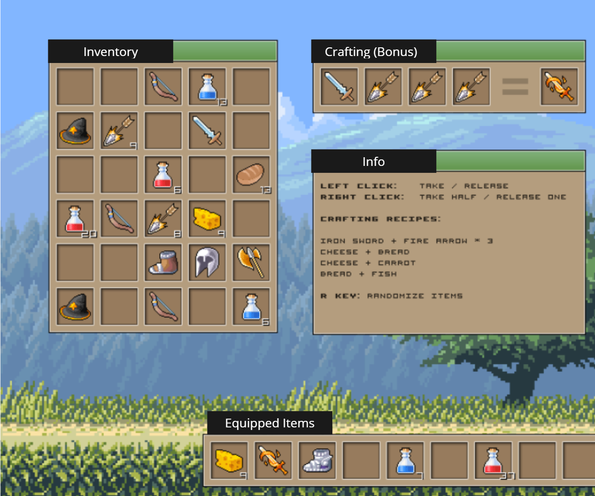

# Ivory Inventory System
### OutScal (C++ Game Developer) Assignment

The project is created for fulfilling the conditions mentioned in OutScal C++/DSA Game Developer role assignment. Below is the target application I need to create.

## Timeline

- Event Handling & Inventory Base : October, 26th, 2023 [2051 HRS]
  

- ItemLoader & Random Item Spawning : October, 27th 2023 [1229 HRS]
  
  
- Item Class & Automatic Texture Loading With Quantity Display : October, 27th 2023 [1358 HRS]
  
